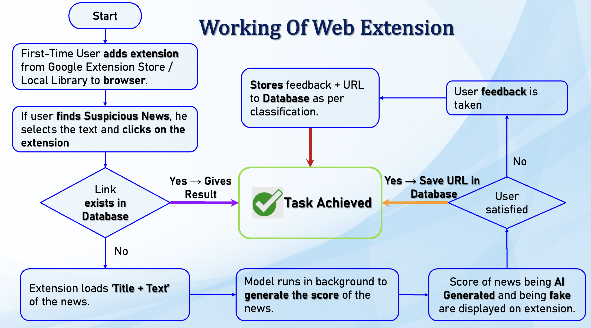

# Fake-News-Prediction
Fake News Prediction using LSTM variants with proposed web-extension

#### -- Project Status: Completed

## Project Intro/Objective
Fake News is any news that is either factually wrong, misrepresents the facts, and that spreads virally (or maybe to a targeted audience).It can be spread both through regular news mediums or on social media platforms like Facebook, Twitter, Youtube etc. Social media deeply influences our global perception and the understanding of events. Thus, detecting fake news is important in recent times because this spread can be 6x faster than genuine news.

The purpose of this project is to develop a web extension that can detect whether the news is fake or real using the machine learning model.

### Methods Used
* Machine Learning
* NLP
* Web-Extension

### Technologies
* Python
* HTML/CSS
* Javascript
* Naive Bayes, LSTM
* Heroku
* GPT-2 by OpenAI

## Project Workflow

## Featured Notebooks/Research Papers
* [Notebook](./BI-DIRECTIONAL-LSTM_ATTENTION.ipynb)
* [Research Paper](https://ieeexplore.ieee.org/document/9362384)

# Demo of web-extension

https://user-images.githubusercontent.com/92680366/137886667-9d833084-4d70-4fd9-817f-7110d9413edf.mp4
